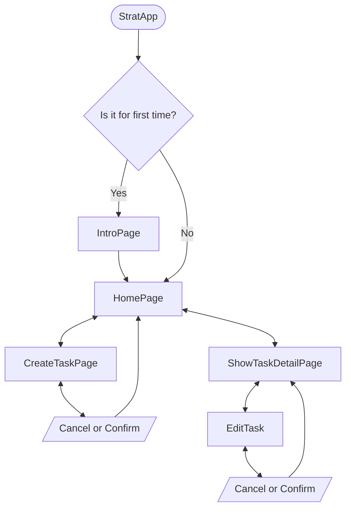

# Taskture

### This app is aimed to be a user-friendly, open-source task and TODO management app designed to simplify your daily life.

Whether you're a busy professional, a student, or someone looking to boost productivity, Taskture provides the tools you need to stay on top of your tasks and achieve your goals.
Join our open-source community and take control of your tasks with Taskture today.

Goals of this app:
- Organize you tasks
- Set priorities
- Track your progress

## Installation
This project is under implements. Installation instruction would be here after first release.

## App screens diagram

## How to tweak this project for your own uses
Since this is an open-source project, I'd encourage you to clone and rename this project to use for your own purposes.

## Find a bug?
- If you found an issue or would like to submit an improvement to this project, please submit an issue using the issues tab above.
- If you would like to submit a PR with a fix, reference the issue you created!
- Don't forget to use right label to help division issues and try not using `Components` label. It's made for development.

## Like this project?
If you are feeling generous, you can support this project by giving a star!